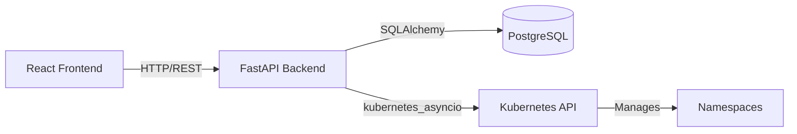

# Mini OpenShift API - Complete Walkthrough

## What Was Built

Successfully implemented the **Mini OpenShift API Backend** with FastAPI, PostgreSQL, JWT authentication, and **Kubernetes integration**.

## Architecture



## Implemented Features

### 1. Database Models
- **Users**: Authentication, roles (Admin/Developer)
- **Projects**: Maps to K8s Namespaces with metadata (owner, description, timestamps)

### 2. API Endpoints

#### Authentication
- `POST /api/v1/login/access-token`: Get JWT token

#### Users
- `POST /api/v1/users/`: Register new user
- `GET /api/v1/users/`: List users (authenticated)
- `GET /api/v1/users/me`: Get current user

#### Projects (with K8s Integration)
- `POST /api/v1/projects/`: Create project + K8s namespace
- `GET /api/v1/projects/`: List projects
- `DELETE /api/v1/projects/{id}`: Delete project + K8s namespace

### 3. Kubernetes Integration

**Automatic Namespace Management:**
- Creating a project automatically creates a K8s namespace
- Deleting a project automatically deletes the K8s namespace
- Project names are validated to be K8s-compatible (lowercase, alphanumeric, hyphens)
- Namespaces are labeled with `managed-by: mini-openshift`

## Swagger UI


## Verification Tests

### Core API Tests
All API endpoints tested successfully:

```
1. Registering User...
   ✓ Success: User created

2. Logging in...
   ✓ Success: JWT token received

3. Creating Project...
   ✓ Success: Project created

4. Listing Projects...
   ✓ Success: Projects retrieved
```

### Kubernetes Integration Tests
All K8s integration tests passed:

```
1. Login
   ✓ Success: Got token

2. Create Project 'test-k8s-project'
   ✓ Success: Project created

3. Verify K8s namespace exists
   ✓ Success: Namespace exists in K8s
   NAME               STATUS   AGE
   test-k8s-project   Active   1s

4. Test invalid project name (uppercase)
   ✓ Success: Validation rejected invalid name

5. Delete project
   ✓ Success: Project deleted

6. Verify K8s namespace deleted
   ✓ Success: Namespace deleted from K8s
```

## Tech Stack

| Component | Technology |
|-----------|-----------|
| Framework | FastAPI |
| Database | PostgreSQL |
| ORM | SQLAlchemy (Async) |
| Migrations | Alembic |
| Auth | JWT (python-jose) |
| Password Hashing | bcrypt |
| K8s Client | kubernetes_asyncio |

## Running the Application

```bash
# Start the server
cd mini-openshift-fastapi
source venv/bin/activate
uvicorn app.main:app --reload --port 8000

# Access Swagger UI
open http://localhost:8000/docs
```

## Testing with kubectl

```bash
# List namespaces managed by mini-openshift
kubectl get namespaces -l managed-by=mini-openshift

# Describe a specific namespace
kubectl describe namespace <project-name>
```

## Next Steps

1. **Deployment Endpoints**: Add endpoints to create/manage K8s Deployments
2. **Pod Management**: Add endpoints to view pods and stream logs
3. **Services**: Expose deployments via K8s Services
4. **React Frontend**: Build the UI to interact with the API
